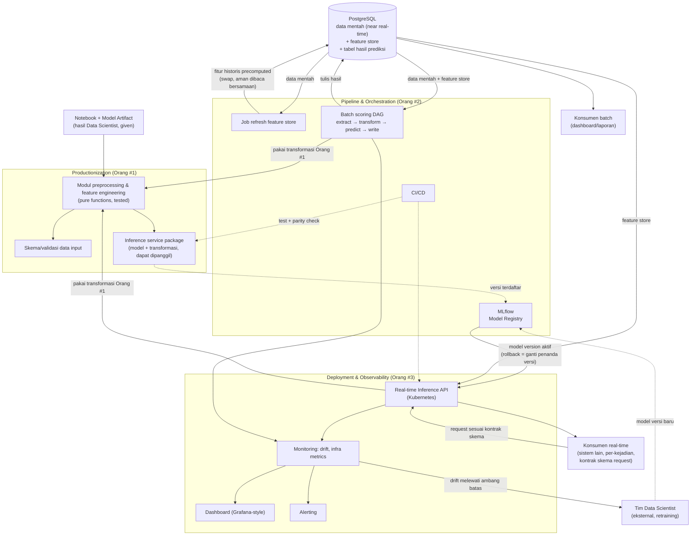

# Rancangan Arsitektur — MLOps Platform

**Perusahaan Telekomunikasi — Churn/Risk Prediction (Portofolio)**

| | |
|---|---|
| **Cakupan sistem** | Dari model terlatih (notebook + artifact hasil training, sudah selesai — di luar cakupan) sampai model bisa dipakai, dipantau, dan di-maintain di production |
| **Tidak termasuk** | Training dan modeling — data scientist sudah menyelesaikan ini secara terpisah; dokumen ini dimulai dari titik notebook diserahkan |
| **Pola sumber data** | PostgreSQL, disuntik data generator secara near real-time (di luar cakupan sistem ini — dianggap given) |
| **Tech stack yang sudah pasti** | PostgreSQL (sumber data), MLflow (model registry & experiment tracking), Docker (containerization), Kubernetes (deployment target) |
| **Tim** | 3 orang — lihat Bagian 4 untuk pembagian kepemilikan |
| **Status dokumen** | Draft — sebagian keputusan menunggu digali lebih jauh saat pengerjaan (lihat Bagian 10) |

---

## Cara Membaca Dokumen Ini

Dokumen ini adalah **arsitektur induk**, dasar bagi tiga dokumen rancangan implementasi terpisah (satu per pemilik pekerjaan). Ia menetapkan keputusan yang membatasi ketiga pekerjaan itu — pembagian tanggung jawab, kontrak antar pekerjaan, keputusan besar yang sudah final — tapi sengaja **tidak** menentukan detail teknis atomic (skema tabel persis, jenis output model, threshold drift, dsb). Detail itu digali oleh pemilik pekerjaan masing-masing saat mengerjakan, sesuai kondisi nyata yang ditemukan — bukan diasumsikan di muka di dokumen ini.

Tiga dokumen turunan:
- `mlops-01-productionization.md` — Orang #1
- `mlops-02-pipeline-orchestration.md` — Orang #2
- `mlops-03-deployment-observability.md` — Orang #3

---

## 1. Ringkasan

Sistem ini menerima model prediksi tabular (klasifikasi/skoring risiko subscriber) yang sudah selesai dilatih, dalam bentuk notebook eksploratif, dan membangun semua yang diperlukan agar model itu bisa dipakai secara andal di production — dua jalur pemakaian sekaligus:

1. **Batch scoring terjadwal** — untuk kebutuhan agregat/pelaporan (mis. dashboard risiko churn bulanan).
2. **Real-time inference API** — untuk kebutuhan keputusan per-kejadian (mis. skor risiko dibutuhkan seketika saat ada trigger tertentu dari sistem lain).

Kedua jalur ini melayani **konteks bisnis yang berbeda** (bukan sekadar dua cara mengakses angka yang sama), tapi keduanya **wajib memakai satu sumber kebenaran yang sama** untuk logika transformasi data dan definisi fitur — ini prinsip yang menembus seluruh rancangan ini dan dijelaskan di Bagian 3.

---

## 2. Prinsip Arsitektur yang Mengikat Seluruh Pekerjaan

Beberapa keputusan berikut sudah final di level dokumen ini dan **membatasi** ruang gerak ketiga pemilik pekerjaan — bukan pilihan bebas yang bisa diputuskan ulang secara sepihak di dokumen turunan:

- **Satu sumber kebenaran untuk transformasi data.** Logika preprocessing dan feature engineering yang dipakai saat training harus jadi **satu-satunya** logika yang dipakai baik di batch pipeline maupun real-time API. Tidak boleh ada dua implementasi terpisah yang "seharusnya sama". Ini mencegah dua kelas bug sekaligus: *training-serving skew* (production beda dari training) dan *batch-realtime skew* (dua jalur serving saling tidak konsisten).
- **Feature store precomputed, bukan on-the-fly di jalur real-time.** Model memakai kombinasi fitur "seketika" (tersedia langsung dari data yang menyertai satu kejadian) dan fitur "historis/agregat" (butuh melihat rekam jejak, mahal dihitung ulang dalam hitungan milidetik). Fitur historis dihitung di muka secara berkala dan disimpan di PostgreSQL sebagai feature store sederhana — real-time API membaca nilai yang sudah siap, tidak menghitung ulang agregasi berat saat request datang.
- **MLflow untuk registry dan tracking, bukan untuk serving.** Model diregistrasi dan diversi lewat MLflow; MLflow tidak dipakai sebagai serving layer — serving dibangun sebagai service tersendiri (lihat Bagian 3.3) yang me-load model dari registry.
- **Kubernetes sebagai target deployment**, konsisten dipakai baik untuk service real-time API maupun (bila relevan) komponen batch yang butuh dijalankan sebagai job terkontainer.
- **Hybrid serving punya dua konteks berbeda, bukan satu use case dua rupa.** Batch untuk kebutuhan agregat/historis; real-time untuk keputusan per-kejadian yang butuh model dipanggil langsung (true online inference — bukan sekadar membaca hasil batch terakhir).
- **Kontrak skema request real-time API adalah kontrak tersendiri, setara skema tabel database.** Fitur "seketika" pada jalur real-time datang dari payload request, bukan dari query ke PostgreSQL — nama field, tipe, dan makna field di request itu harus dijamin identik dengan kolom yang dipakai modul transformasi di jalur batch. Ini bukan detail implementasi API biasa; ini titik rawan *skew* kedua (di luar training-serving skew) yang harus dikunci sejak desain, bukan diasumsikan otomatis konsisten karena "sama-sama dari Orang #1".
- **Feature store harus aman dibaca kapan pun, termasuk saat sedang di-refresh.** Real-time API membaca feature store dengan frekuensi tinggi dan tidak boleh menerima data setengah-refresh, error, atau downtime baca akibat proses refresh yang dijalankan orchestration. Mekanisme refresh (mis. swap table, bukan update in-place) adalah keputusan arsitektural, didetailkan di dokumen Orang #2, tapi prinsip "read tidak boleh terganggu tulis" berlaku sejak sekarang.
- **Kesepakatan model usang dan retraining adalah kontrak eksplisit, bukan dibiarkan implisit.** Karena training berada di luar cakupan sistem ini (dipegang tim Data Scientist eksternal), sistem ini wajib punya jalur eksplisit: siapa/apa yang diberi tahu ketika drift terdeteksi melewati ambang batas, dan apa bentuk pemicunya (notifikasi ke tim Data Scientist untuk retraining manual, atau trigger otomatis ke pipeline training eksternal). Monitoring drift tanpa jalur tindak lanjut yang disepakati hanya menghasilkan dashboard yang dilihat tapi tidak memicu aksi apa pun.
- **Rollback berarti mengganti versi model aktif di registry, bukan rollback deployment penuh.** Karena baik batch pipeline maupun real-time API meng-*consume* model dari MLflow registry (Bagian 5), rollback yang cepat dan aman dilakukan dengan mengubah versi mana yang ditandai aktif di registry — bukan dengan redeploy ulang container/image. Ini keputusan arsitektural yang memengaruhi bagaimana Orang #2 mendesain mekanisme promosi versi dan bagaimana Orang #3 mendesain service supaya bisa mendeteksi/mengambil model versi aktif terbaru tanpa restart penuh.
- **Konsistensi output antar dua jalur diverifikasi secara aktif, bukan diasumsikan dari desain.** Prinsip "satu sumber kebenaran" (poin pertama di atas) adalah niat desain; kepatuhan terhadapnya perlu dibuktikan lewat pengujian eksplisit yang membandingkan output batch dan output real-time untuk input yang identik. Tanpa ini, penyimpangan kecil (mis. saat salah satu jalur dioptimasi performanya) bisa lolos tanpa terdeteksi.

---

## 3. Arsitektur Keseluruhan (End-to-End)

### 3.1 Titik Mulai: Serah Terima dari Data Scientist

Input pekerjaan ini adalah notebook eksploratif plus model artifact hasil training yang sudah selesai. Dokumen ini tidak mengatur bagaimana model dilatih atau divalidasi secara statistik — itu sudah selesai. Yang diatur adalah bagaimana hasil kerja itu diubah menjadi sesuatu yang bisa diandalkan sistem lain.

### 3.2 Jalur Batch

Data mentah di PostgreSQL (disuntik near real-time oleh data generator) → dibaca terjadwal oleh pipeline orchestration → ditransformasi memakai logika yang sama dengan Orang #1 → diprediksi memakai model dari MLflow registry → hasil ditulis balik ke PostgreSQL, dikonsumsi dashboard/laporan.

### 3.3 Jalur Real-Time

Request datang ke inference API (di Kubernetes) → API mengambil fitur seketika dari payload request, mengambil fitur historis dari feature store di PostgreSQL → menjalankan transformasi yang **sama persis** dengan jalur batch dan training → model (versi aktif dari MLflow registry, di-load ke dalam service) menghasilkan prediksi → dikembalikan langsung ke pemanggil.

### 3.4 Feature Store sebagai Jembatan Dua Jalur

Feature store bukan komponen milik satu jalur saja — ia adalah titik temu yang membuat batch dan real-time bisa berbagi definisi fitur historis yang sama, tanpa real-time API perlu menghitung ulang agregasi berat setiap request. Refresh berkala terhadap feature store ini menjadi tanggung jawab orchestration (Orang #2), sedangkan **definisi** perhitungan fiturnya tetap satu sumber kebenaran dari modul yang dibangun Orang #1. Mekanisme refresh perlu menjamin real-time API tidak pernah membaca data setengah-refresh (lihat prinsip di Bagian 2) — detail teknisnya (mis. swap table vs mekanisme lain) diputuskan Orang #2.

### 3.5 Dua Kontrak yang Sering Terlewat: Skema Request dan Verifikasi Parity

Dua hal berikut mudah luput karena tidak terlihat sebagai "komponen" di diagram, tapi menentukan apakah prinsip satu sumber kebenaran (Bagian 2) benar-benar terjaga:

- **Skema request real-time API** adalah kontrak yang setara pentingnya dengan skema tabel PostgreSQL. Field yang dikirim konsumen real-time (mis. sistem lain yang memicu skor risiko saat ada kejadian) harus dipetakan eksplisit ke kolom yang sama yang dipakai modul transformasi Orang #1 saat membaca dari database di jalur batch. Kontrak ini dipegang bersama oleh Orang #1 (pemilik definisi fitur) dan Orang #3 (pemilik desain API), didetailkan di dokumen masing-masing.
- **Verifikasi parity** — pengujian yang secara eksplisit membandingkan output dua jalur untuk input yang identik — adalah kontrol yang membuktikan prinsip satu sumber kebenaran benar-benar terjaga dari waktu ke waktu, bukan hanya benar di hari pertama desain. Ini sebaiknya jadi bagian dari CI/CD (lihat Bagian 6.1), bukan pengujian manual sesekali.

---

## 4. Pembagian Kepemilikan Pekerjaan

| Pemilik | Fokus | Titik mulai | Titik akhir |
|---|---|---|---|
| **Orang #1** | Productionization | Notebook + model artifact mentah | Modul transformasi teruji + inference service package siap dipanggil |
| **Orang #2** | Pipeline & Orchestration | Modul dari Orang #1 tersedia | Batch pipeline berjalan otomatis, feature store ter-refresh, hasil tertulis ke PostgreSQL, CI/CD aktif, model teregistrasi di MLflow |
| **Orang #3** | Deployment & Observability | Inference service (Orang #1) dan pipeline (Orang #2) tersedia | Real-time API berjalan di Kubernetes, seluruh sistem termonitor dan teralert, rollback tersedia |

Ketiganya **tidak berjalan sepenuhnya sekuensial** — ada titik-titik yang bisa dimulai paralel begitu kontrak antar pekerjaan disepakati (lihat catatan dependency di tiap dokumen turunan). Namun ada satu urutan keras yang tidak bisa dilanggar: **modul transformasi dari Orang #1 harus stabil sebelum baik Orang #2 maupun Orang #3 bisa menyelesaikan bagian yang bergantung padanya** — karena modul itulah satu sumber kebenaran yang mengikat batch dan real-time.

### 4.1 Kontrak Antar Pekerjaan

Beberapa titik ini perlu disepakati eksplisit di awal, bukan ditebak belakangan saat sudah berjalan:

- **Orang #1 ↔ Tim Database/sumber data**: skema tabel mentah di PostgreSQL — kolom apa saja yang tersedia, tipe data, semantik kolom yang ambigu.
- **Orang #1 → Orang #2 dan Orang #3**: bentuk modul transformasi (fungsi/paket apa yang bisa dipanggil, kontrak input-output-nya) dan skema data input yang divalidasi.
- **Orang #2 → Orang #3**: skema tabel hasil batch prediksi dan skema feature store di PostgreSQL (nama tabel, kolom, kapan di-refresh) — dibutuhkan Orang #3 untuk memastikan real-time API membaca sumber yang konsisten.
- **Orang #2 ↔ Orang #3**: model registry MLflow — konvensi versi mana yang dianggap "aktif" dan bagaimana kedua jalur (batch dan real-time) mengambil versi yang sama saat suatu model baru dipromosikan.
- **Orang #3 ← Orang #1 dan Orang #2**: masukan metrik apa yang relevan dipantau (Orang #1: distribusi fitur/prediksi; Orang #2: kesehatan orchestration) — dashboard dan alerting adalah kepemilikan teknis Orang #3, tapi isinya kolaboratif.

---

## 5. Model Registry, Versioning, dan Siklus Hidup Model

### 5.1 Registry (MLflow)

- MLflow dipakai untuk **model registry** (versi mana yang aktif/production, riwayat versi sebelumnya) dan **experiment tracking** (parameter, metrik dari proses training — meski training sendiri di luar cakupan, riwayat ini tetap relevan untuk ditelusuri saat model production perlu dibandingkan ke iterasi sebelumnya).
- MLflow **tidak** dipakai sebagai serving layer di sistem ini — baik batch pipeline maupun real-time API meng-*consume* model dari registry (memuat artifact ke dalam proses masing-masing), bukan memanggil MLflow serving endpoint secara langsung.
- Konvensi promosi versi (staging → production, atau setara) dan siapa yang berwenang mempromosikan adalah detail yang diselesaikan Orang #2 (pemilik model registry) — lihat dokumen turunannya.

### 5.2 Rollback sebagai Perubahan Versi Aktif, Bukan Redeploy

Rollback model didesain sebagai **operasi di level registry**: mengubah penanda versi aktif kembali ke versi sebelumnya. Baik batch pipeline maupun real-time API perlu mampu mendeteksi/mengambil versi aktif terkini tanpa memerlukan rebuild image atau redeploy penuh — ini konsekuensi langsung dari MLflow dipakai sebagai satu-satunya sumber kebenaran versi (5.1). Mekanisme konkret (polling berkala, webhook, atau restart ringan saat versi berubah) didetailkan Orang #3, tapi prinsip "rollback tidak menunggu siklus deploy" berlaku sejak sekarang.

### 5.3 Kontrak Retraining: Apa yang Terjadi Setelah Drift Terdeteksi

Karena training berada sepenuhnya di luar cakupan sistem ini, sistem ini berhenti pada **mendeteksi dan memberi sinyal** — bukan memicu training ulang secara otomatis, kecuali disepakati lain. Yang wajib jelas sejak awal:

- Siapa/apa yang menerima notifikasi ketika metrik drift (Bagian 7) melewati ambang batas — tim Data Scientist eksternal secara langsung, atau lewat kanal yang disepakati.
- Apakah retraining sepenuhnya manual (tim Data Scientist dihubungi, memutuskan sendiri kapan retrain), atau ada mekanisme trigger yang lebih terstruktur (mis. permintaan otomatis ke pipeline training eksternal, meski pipeline itu sendiri di luar cakupan).
- Bagaimana model versi baru hasil retraining itu **masuk kembali** ke sistem ini — lewat registrasi baru ke MLflow registry yang sama, mengikuti kontrak promosi versi di 5.1.

Detail mekanisme kontak dan siapa pihak Data Scientist yang relevan adalah hal yang digali saat pengerjaan (Bagian 10) — yang dikunci di sini hanyalah bahwa **jalur ini harus ada dan disepakati**, bukan dibiarkan sebagai celah antara "monitoring mendeteksi" dan "sesuatu terjadi".

### 5.4 Kompatibilitas Skema Saat Promosi Versi Baru

Jika model versi baru membutuhkan fitur yang belum ada di feature store atau skema request real-time (lihat 3.5), promosi versi baru **tidak boleh** dilakukan sebelum feature store dan kontrak skema request diperbarui untuk menyediakannya. Ini juga berarti: saat rollback ke versi lama terjadi (5.2), versi lama itu perlu tetap bisa berjalan dengan skema yang tersedia saat itu — perubahan skema yang bersifat *breaking* untuk versi sebelumnya adalah risiko yang perlu disadari eksplisit, bukan ditemukan saat rollback darurat sedang berlangsung.

### 5.5 Validasi Artifact Sebelum Registrasi dan Sebelum Promosi

Dua gerbang berbeda, jangan ditukar:

- **Sebelum registrasi ke MLflow** — model artifact hasil training (given, dari Data Scientist) perlu lolos sanity check dasar sebelum layak masuk registry sebagai kandidat versi: dapat dimuat tanpa error, menghasilkan output dengan bentuk/tipe yang sesuai kontrak untuk sejumlah input uji, dan tidak menghasilkan nilai tidak valid (mis. NaN) untuk input yang valid. Ini gerbang teknis minimal — bukan evaluasi performa model, karena performa model itu sendiri adalah keputusan Data Scientist yang sudah selesai di luar cakupan sistem ini.
- **Sebelum promosi jadi versi aktif** — di luar sanity check teknis, sebaiknya ada tahap perbandingan singkat terhadap data production terkini (mis. menjalankan versi kandidat berdampingan dengan versi aktif terhadap sampel data yang sama, membandingkan pola hasil) sebelum benar-benar ditandai aktif. Ini bukan proses otomatis yang kompleks (canary/shadow deployment penuh sengaja di luar cakupan sistem ini, lihat Bagian 9) — cukup langkah verifikasi sadar yang mencegah promosi versi yang ternyata bermasalah langsung berdampak ke seluruh trafik produksi.

Detail konkret kedua gerbang ini (apa yang dianggap "lolos", berapa banyak sampel data, siapa yang menjalankan) didetailkan Orang #2 sebagai pemilik model registry.

### 5.6 Lineage: Setiap Prediksi Bisa Ditelusuri Asalnya

Setiap baris hasil prediksi — baik dari jalur batch maupun real-time — wajib menyimpan minimal dua informasi penjejak: **versi model** yang menghasilkannya, dan **waktu/snapshot data** yang dipakai saat prediksi dibuat. Tanpa ini, ketika drift atau anomali ditemukan di kemudian hari, tidak ada cara menelusuri balik prediksi mana yang dihasilkan versi model mana — traceability ini bukan fitur tambahan, melainkan prasyarat agar rollback (5.2) dan investigasi drift (Bagian 8) punya sesuatu yang bisa dirujuk. Skema kolom konkret (nama, tipe) didetailkan Orang #2 untuk tabel hasil batch dan Orang #3 untuk response real-time API, tapi kewajiban menyimpan kedua informasi ini berlaku di kedua jalur tanpa kecuali.

---

## 6. CI/CD, Reproducibility, dan Beban Database

### 6.1 Cakupan CI/CD

CI/CD (disebut sebagai tanggung jawab Orang #2 di Bagian 4) mencakup lebih dari sekadar "jalankan test lalu deploy". Tiga hal yang wajib jadi gerbang, bukan langkah opsional:

- **Kode transformasi** (Orang #1): unit test modul preprocessing/feature engineering wajib lolos sebelum kode itu dipakai baik oleh DAG batch maupun service real-time.
- **Kualitas data input** (Orang #2): sebelum data mentah harian diproses lebih lanjut oleh batch pipeline, data itu perlu lolos pemeriksaan kewajaran dasar (volume baris tidak anjlok/melonjak drastis dibanding pola biasanya, proporsi nilai kosong pada kolom kritis tidak tiba-tiba melonjak, nilai pada kolom kunci tidak keluar dari rentang wajar) — ini gerbang yang berbeda dari validasi skema (Milestone 1.3 di `mlops-01-productionization.md`, yang memeriksa bentuk data) dan berbeda dari drift (Bagian 8, yang membandingkan ke baseline training): ini soal kewajaran data hari ini dibanding pola hari-hari sebelumnya, independen dari model.
- **Verifikasi parity** (lihat 3.5): pengujian yang membandingkan output batch vs real-time untuk input identik, dijalankan sebagai bagian pipeline CI, bukan manual sesekali.
- **Deployment service** (Orang #3): build image, jalankan test, baru deploy ke Kubernetes — dengan kemampuan rollback deployment (terpisah dari rollback versi model, lihat 5.2) jika deployment baru gagal health check.

Detail tool dan konfigurasi pipeline CI/CD didetailkan Orang #2, mengikuti gerbang di atas sebagai prinsip yang mengikat.

### 6.2 Reproducibility Environment

Notebook eksploratif dari Data Scientist lazimnya tidak mengunci versi dependency (library) secara ketat. Sebelum model dan modul transformasi dipakai di production, environment training perlu direplikasi secara presisi — khususnya versi library yang dipakai untuk membentuk/menyerialisasi model (mis. scikit-learn, xgboost, atau setara) — karena model yang dilatih dengan satu versi library dapat gagal dimuat atau menghasilkan output berbeda saat dijalankan dengan versi berbeda di production. Ini menjadi tanggung jawab awal Orang #1 (mengunci dependency saat modularisasi notebook), dan dijaga konsisten oleh Orang #3 saat containerization.

### 6.3 Isolasi Beban terhadap PostgreSQL

PostgreSQL di sistem ini menerima empat pola akses berbeda secara bersamaan: tulis near real-time dari data generator (given, di luar cakupan), baca berat oleh batch pipeline (agregasi, scan historis), tulis hasil oleh batch pipeline, dan baca frekuensi tinggi/latensi rendah oleh real-time API. Keempatnya bersaing atas resource database yang sama. Prinsip yang berlaku sejak sekarang: pola akses berat (batch, refresh feature store) tidak boleh mendegradasi pola akses yang butuh latensi rendah (real-time API) tanpa disadari. Mekanisme konkret (mis. read replica bila diperlukan, connection pooling, penjadwalan batch di luar jam sibuk, atau cukup index yang tepat mengingat skala portofolio) didetailkan Orang #2 dan Orang #3 sesuai temuan beban nyata — tapi kesadaran risikonya dikunci di sini agar tidak jadi masalah yang "baru ketahuan" setelah keempat pola akses berjalan bersamaan.

---

## 7. Keamanan dan Akses (Prinsip Dasar)

Detail konkret didiskusikan di tiap dokumen turunan sesuai kebutuhan nyata yang ditemukan, tapi prinsip berikut mengikat sejak awal:

- Kredensial yang dipakai batch pipeline untuk menulis ke PostgreSQL sebaiknya terpisah dari kredensial yang dipakai real-time API untuk membaca — keduanya punya pola akses berbeda (batch: read+write terjadwal; real-time: read-only frekuensi tinggi) dan sebaiknya bisa diaudit/dibatasi secara independen.
- Tidak ada kredensial produksi yang di-hardcode di kode maupun notebook — ini relevan khusus karena titik mulai pekerjaan ini adalah notebook eksploratif yang sifatnya sering longgar soal ini.
- Akses **tulis** ke MLflow registry (siapa/apa yang boleh mendaftarkan versi baru atau mengubah penanda versi aktif) dibatasi eksplisit — mengingat registry adalah satu sumber kebenaran yang dipakai kedua jalur serving (Bagian 5), registry yang bisa ditulis oleh siapa saja adalah titik rawan yang berdampak langsung ke production.

---

## 8. Observability — Prinsip Dasar

Tiga jenis sinyal yang perlu dipantau, dengan sifat berbeda (mengikuti pola yang lazim di MLOps, konsisten dengan tiga concern yang sudah disebut eksplisit di deskripsi Orang #3):

| Jenis | Fokus | Contoh |
|---|---|---|
| **Infra/operational** | Apakah service hidup dan responsif | Latency, throughput, error rate API; status job batch |
| **Data & model drift** | Apakah data hari ini masih mirip data training | Distribusi fitur input dibanding baseline training; distribusi output prediksi |
| **Pipeline health** | Apakah orchestration berjalan sesuai jadwal | DAG selesai tepat waktu, task mana yang sering gagal, status refresh feature store, status tulis-balik ke PostgreSQL |

Ketiganya dikonsolidasi jadi satu dashboard dan satu jalur alerting oleh Orang #3, tapi isinya bersumber dari ketiga pemilik pekerjaan (lihat 4.1).

### 8.1 Kontrak Kegagalan pada Real-Time API

Konsumen real-time (sistem lain yang memanggil API) butuh kontrak yang jelas soal apa yang terjadi ketika API **tidak bisa** menghasilkan prediksi — mis. feature store sedang tidak terjangkau, model gagal dimuat, atau request tidak lolos validasi skema (3.5). Respons kegagalan ini (error terstruktur dengan alasan, bukan diam-diam mengembalikan nilai default yang terlihat seperti prediksi valid) adalah keputusan desain, bukan detail teknis yang bisa diserahkan sepenuhnya ke implementasi — karena konsumen di sisi lain perlu tahu cara membedakan "model bilang risiko rendah" dari "sistem sedang gagal menjawab". Detail konkret (kode status, format payload error) didetailkan Orang #3.

### 8.2 Runbook Operasional

Selain dashboard dan alerting, sistem ini perlu satu dokumen operasional ringkas (runbook) yang merangkum skenario kegagalan umum dan langkah responsnya — drift terdeteksi, DAG batch gagal, real-time API down, kebutuhan rollback mendesak — sebagai satu rujukan tunggal, bukan tersebar di catatan masing-masing pekerjaan. Ini bukan dokumen arsitektur baru, melainkan ringkasan praktis yang disusun Orang #3 (pemilik dashboard/alerting) berdasarkan skenario yang sudah dibahas di seluruh dokumen — relevan disusun setelah observability (Bagian 8) berjalan, bukan di awal sebelum ada skenario nyata untuk dirujuk.

### 8.3 Dua Dashboard, Satu Sumber Data Monitoring

Sistem ini menyediakan **dua permukaan dashboard** dengan tujuan berbeda, bukan dua kali membangun mekanisme observability yang sama:

- **Dashboard internal (Grafana)** — untuk pemakaian tim sendiri, tidak dipublikasikan (keterbatasan tier gratis Grafana tidak mendukung publicly shared dashboard).
- **Dashboard publik (web custom)** — untuk kebutuhan portofolio, dapat diakses siapa pun tanpa login, secara sengaja dibuat menampilkan cakupan yang sama dengan dashboard internal.

Prinsip yang mengikat: **PostgreSQL adalah sumber utama data monitoring**, bukan sekadar salinan dari Prometheus atau sumber metrik lain. Baik Grafana maupun API publik membaca dari tabel yang sama di PostgreSQL — ini konsisten dengan prinsip satu sumber kebenaran yang sudah berlaku di seluruh sistem ini (Bagian 2), diterapkan sekarang ke domain observability. Konsekuensinya:

- Metrik mentah resolusi tinggi (mis. request-per-detik) tetap boleh melalui Prometheus untuk kebutuhan troubleshooting internal yang sifatnya sesaat, tapi nilai yang **direpresentasikan di kedua dashboard** adalah hasil agregasi periodik (mis. per menit) yang ditulis ke PostgreSQL — bukan Prometheus di-query langsung oleh salah satu dashboard sementara yang lain dari PostgreSQL, karena itu akan membuka celah dua sumber kebenaran yang bisa saling tidak konsisten.
- Dashboard publik tidak boleh mengakses Grafana maupun kredensial internal secara langsung — ia dilayani lewat **API publik read-only** yang membaca dari PostgreSQL dengan scope akses yang dibatasi (hanya tabel monitoring yang memang dimaksudkan publik, tidak ada jalur ke kredensial atau tabel produksi lain).
- Cakupan konten yang dipublikasikan (apakah dashboard publik menampilkan seluruh tiga pilar observability atau ada yang sengaja dikecualikan) **sengaja tidak dikunci di sini** — digali saat pengerjaan milestone terkait (lihat Bagian 10).

Mekanisme konkret (skema tabel monitoring di PostgreSQL, bentuk API, teknologi dashboard publik) didetailkan Orang #3 di dokumen turunannya.

---

## 9. Yang Sengaja Berada di Luar Cakupan

Beberapa kapabilitas yang lazim dibahas di sistem MLOps production skala besar sengaja **tidak** dibangun di sistem ini, mengingat konteksnya proyek portofolio dengan tim 3 orang — bukan karena terlewat, tapi karena kompleksitas tambahannya tidak sepadan dengan manfaatnya di skala ini:

- **Canary/shadow deployment penuh untuk real-time API** — mengarahkan sebagian kecil trafik produksi ke versi baru sebelum rollout penuh. Sebagai gantinya, sistem ini memakai verifikasi lebih ringan sebelum promosi (Bagian 5.5) plus kemampuan rollback cepat (5.2) sebagai mitigasi risiko. Bisa dipertimbangkan sebagai peningkatan lanjutan jika volume trafik production sungguhan tumbuh signifikan.
- **Disaster recovery formal untuk MLflow registry dan feature store** (backup terjadwal, prosedur restore teruji) — pada skala ini, registry dan feature store dianggap bisa dibangun ulang dari sumber (model artifact asli, data mentah PostgreSQL) dalam waktu wajar jika hilang, sehingga backup formal belum menjadi prioritas. Ini asumsi yang perlu ditinjau ulang jika sistem ini pernah dipakai di luar konteks portofolio.
- **Cost monitoring/optimization formal untuk Kubernetes** — resource sizing (Bagian 8, dan Milestone terkait di `mlops-03-deployment-observability.md`) didekati dari sisi kecukupan performa, bukan efisiensi biaya granular. Kesadaran biaya tetap relevan secara kualitatif (jangan boros resource tanpa alasan), tapi pemantauan biaya terperinci di luar cakupan.

---

## 10. Area yang Sengaja Dibiarkan Terbuka

Konsisten dengan prinsip bahwa dokumen ini adalah rancangan kerja (bukan spesifikasi atomic), area berikut **sengaja tidak dikunci** di sini — akan digali oleh pemilik pekerjaan terkait saat milestone yang relevan mulai dikerjakan:

| Area | Digali oleh | Kapan relevan |
|---|---|---|
| Skema persis tabel mentah PostgreSQL | Orang #1 | Sejak milestone pertama |
| Jenis output model (biner/skor kontinu/multi-kelas) dan fitur konkret | Orang #1 | Saat membedah notebook |
| Skema request real-time API (field, tipe, pemetaan ke kolom) | Orang #1 dan Orang #3 bersama | Saat modul transformasi mulai stabil |
| Frekuensi batch scoring (harian/tiap jam/dsb) dan frekuensi refresh feature store | Orang #2, berdasarkan temuan Orang #1 soal karakteristik fitur | Saat merancang DAG |
| Mekanisme refresh feature store yang aman dibaca bersamaan (mis. swap table) | Orang #2 | Saat merancang job refresh feature store |
| Tool orchestrator, CI/CD, monitoring stack konkret | Masing-masing pemilik, lihat opsi ilustratif di tiap dokumen turunan | Saat implementasi |
| Threshold drift yang dianggap signifikan | Orang #1 dan Orang #3 bersama | Setelah baseline data training tersedia |
| Jalur/kanal konkret notifikasi retraining ke tim Data Scientist eksternal | Orang #3 (pemilik alerting), disepakati dengan tim Data Scientist | Setelah mekanisme drift monitoring berjalan |
| Mekanisme deteksi versi aktif berubah di sisi service (polling/webhook/dsb) | Orang #3 | Saat merancang inference service |
| Skema tabel hasil prediksi dan tabel feature store | Orang #2, dikomunikasikan ke Orang #3 | Saat merancang DAG |
| Ambang batas kewajaran data harian (volume, proporsi NULL, rentang nilai) untuk gerbang kualitas data | Orang #2 | Saat merancang gerbang CI/CD kualitas data |
| Kriteria lolos sanity check artifact dan mekanisme verifikasi sebelum promosi | Orang #2 | Saat merancang mekanisme registrasi dan promosi model |
| Kolom konkret untuk lineage (nama, tipe, format) di tabel hasil batch dan response real-time | Orang #2 (batch) dan Orang #3 (real-time) | Saat merancang skema tabel hasil dan response API |
| Isi dan format runbook operasional | Orang #3 | Setelah observability (dashboard/alerting) berjalan |
| Skema tabel monitoring di PostgreSQL dan frekuensi agregasi dari Prometheus | Orang #3 | Saat merancang penyimpanan data monitoring |
| Cakupan konten dashboard publik (apakah identik dengan dashboard internal atau ada yang dikecualikan) | Orang #3 | Saat merancang dashboard publik dan API publik |
| SLA latency real-time API dan format kontrak error/fallback | Orang #3, berdasar kebutuhan konsumen real-time yang konkret | Saat merancang service |
| Mekanisme isolasi beban database (read replica/pooling/penjadwalan) bila diperlukan | Orang #2 dan Orang #3, berdasarkan beban nyata yang ditemukan | Setelah pipeline batch dan API berjalan bersamaan |
| Penguncian versi dependency/environment training | Orang #1 | Saat modularisasi notebook |

---

*Dokumen ini adalah rancangan arsitektur yang hidup — akan diperbarui seiring temuan dari pengerjaan tiga dokumen turunan.*
